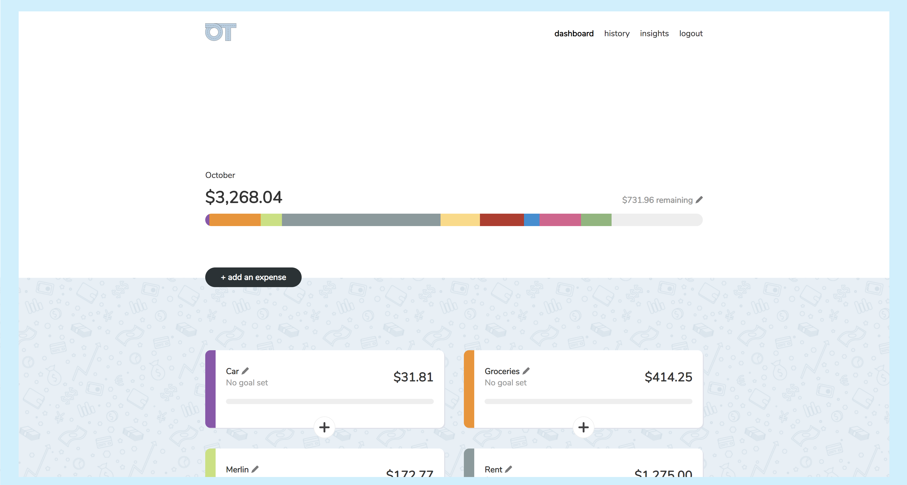
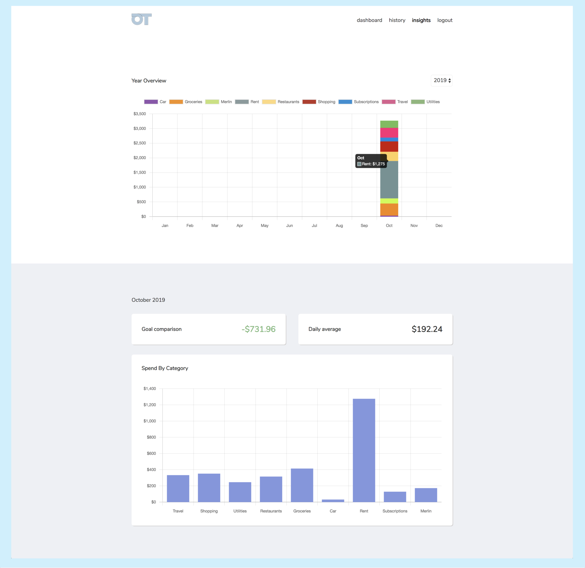
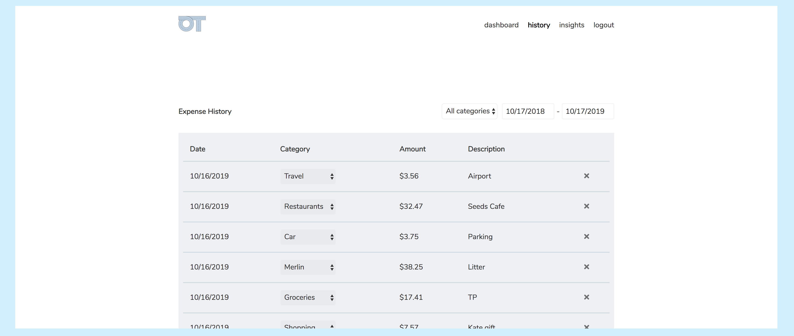
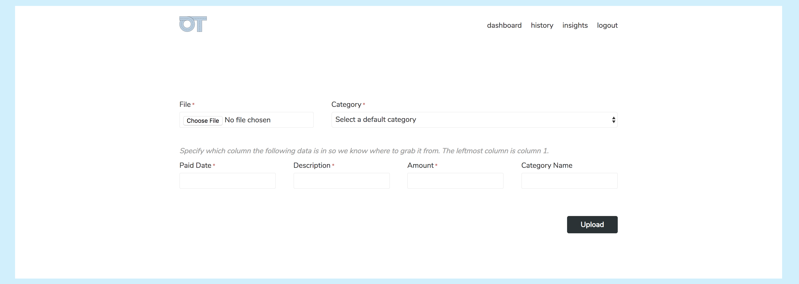
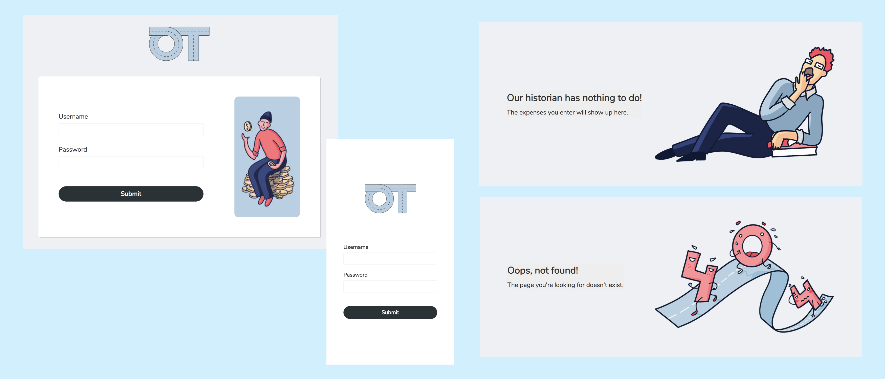

## About

In a nutshell: a private budgeting tool that can be self-hosted.

This project is an attempt to understand and control my own
spending better without giving my banking/financial info
to a 3rd party. The app is meant to be used with 1 login, and
you can host easily your own instance.

The app was designed by [Iana Noda](https://iananoda.com).

## Features

#### Dashboard
The dashboard lets you quickly see how you're doing in the current month.
You can set a spend goal per month and/or per category. This
is also where you quickly add individual expenses.

#### Insights
The insights page lets you review any year or month in more
detail.

#### History
The history page lets you drill down into actual purchases,
as well as do any tweaking (e.g. changing category or deleting).

#### Importing
Although you can't connect banking info, you can still streamline entering expenses.
The CSV import lets you flexibly import expenses from bank exports.

#### Fun and mobile friendly
OnTrack has a light and fun voice that makes it a
pleasure to use. The entire app is also mobile
friendly.

## Installation
### MacOS

#### Getting started with Homebrew
- Make sure [homebrew](https://brew.sh/) is installed
- Fork/clone this repo
- Run `sh scripts.sh install_with_brew`
- Visit http://localhost:3000
- If you have already ran the installation and want to start the server, just run `sh scripts.sh start`

#### Creating a user

- `bundle exec rails c` to run Rails console
- `User.create!(username: "...", password: "...")` The username and password will be hashed.
- If you ever need to change your username/password: `User.first.update!(username: "...", password: "...")`

### On Ubuntu 18.04
- Install `rbenv`
  - `sudo apt install autoconf bison build-essential libssl-dev libyaml-dev libreadline6-dev zlib1g-dev libncurses5-dev libffi-dev libgdbm5 libgdbm-`- Install rbenv dependencies
  - `git clone https://github.com/rbenv/rbenv.git ~/.rbenv` - Install rbenv
  - `echo 'export PATH="$HOME/.rbenv/bin:$PATH"' >> ~/.bashrc` - Add rbenv to path
  - `echo 'eval "$(rbenv init -)"' >> ~/.bashrc`- Makes sure rbenv loads automatically
  - `source ~/.bashrc`- Apply changes to current bash session
- Install `ruby-build`
  - `git clone https://github.com/rbenv/ruby-build.git ~/.rbenv/plugins/ruby-build`
- Install ruby 2.6.0
  - `rbenv install 2.6.0`
  - `rbenv global 2.6.0` - set it as the default
- Install bundler + dependencies
  - `gem install bundler`
  - `bundle install`
  - **NOTE:** Make sure you have postgres-dev-server installed. eg. `sudo apt install postgresql-server-dev-11` if you use Postgres 11
  - `bundle exec rake db:create` (make sure you have `yarn` installed. eg. `sudo apt install yarn` or `npm install -g yarn`). If you run into `error Couldn't find an integrity file `, run `yarn install --check-files` and try again.
  - `bundle exec rake db:migrate`
- Start the appp
  - `bundle exec rails s`
  - Youre good to go! Visit http://localhost:3000

## Hosting your own

I'd recommend using [Heroku](https://heroku.com) since it's super simple (and free) to
deploy a Rails app. All you need to do once your instance is deployed is run
`heroku run bundle exec rails c` to open the Rails console and create your user.

## Usage and feedback
Feel free to use this however you'd like! If you use this, credit
would be nice but I don't really care that much. I'm primarily maintaining
this for my own use cases. But...if you have features you'd like to see built, or changes
that you think should be made, please open issues on this repo and tag me in them!
I'd love to improve the tool from your feedback.
